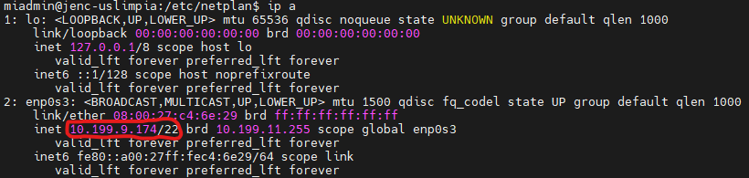
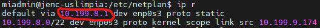
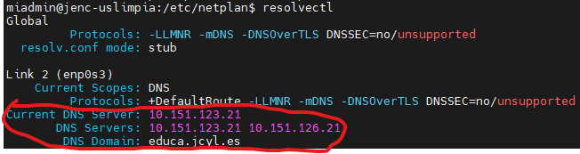
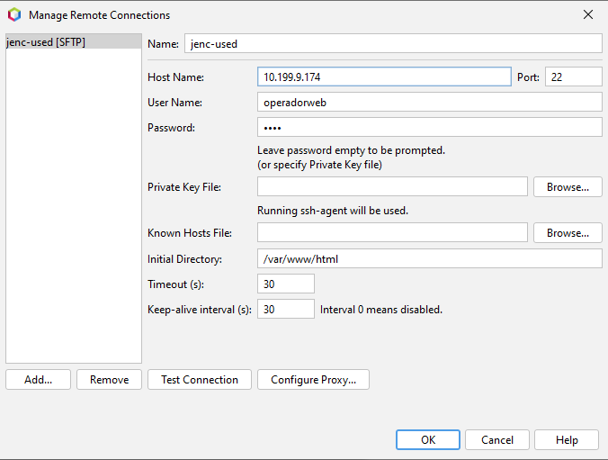

# CFGS Desarrollo de Aplicaciones Web


- [CFGS Desarrollo de Aplicaciones Web](#cfgs-desarrollo-de-aplicaciones-web)
  - [1. Entorno de Desarrollo](#1-entorno-de-desarrollo)
    - [1.1 Ubuntu Server 24.04.3 LTS](#11-ubuntu-server-24043-lts)
      - [1.1.1 **Configuración inicial**](#111-configuración-inicial)
        - [Nombre y configuraicón de red](#nombre-y-configuraicón-de-red)
        - [**Actualizar el sistema**](#actualizar-el-sistema)
        - [**Configuración fecha y hora**](#configuración-fecha-y-hora)
        - [**Cuentas administradoras**](#cuentas-administradoras)
        - [**Habilitar cortafuegos**](#habilitar-cortafuegos)
        - [**Memeoria y almacenamiento**](#memeoria-y-almacenamiento)
      - [1.1.2 Instalación del servidor web](#112-instalación-del-servidor-web)
        - [Instalación](#instalación)
        - [Verficación del servicio](#verficación-del-servicio)
        - [Virtual Hosts](#virtual-hosts)
        - [Permisos y usuarios](#permisos-y-usuarios)
      - [1.1.3 PHP](#113-php)
        - [Instalar php](#instalar-php)
        - [Configurar php](#configurar-php)
      - [1.1.4 MySQL](#114-mysql)
      - [1.1.5 XDebug](#115-xdebug)
      - [1.1.6 DNS](#116-dns)
      - [1.1.7 SFTP](#117-sftp)
      - [1.1.8 Apache Tomcat](#118-apache-tomcat)
      - [1.1.9 LDAP](#119-ldap)
    - [1.2 Windows 11](#12-windows-11)
      - [1.2.1 **Configuración inicial**](#121-configuración-inicial)
        - [**Nombre y configuración de red**](#nombre-y-configuración-de-red)
        - [**Cuentas administradoras**](#cuentas-administradoras-1)
      - [1.2.2 **Navegadores**](#122-navegadores)
      - [1.2.3 **FileZilla**](#123-filezilla)
      - [1.2.4 **Netbeans**](#124-netbeans)
        - [**Creación de proyectos**](#creación-de-proyectos)
      - [1.2.5 **Visual Studio Code**](#125-visual-studio-code)
  - [2. GitHub](#2-github)
  - [3.Entorno de Explotación](#3entorno-de-explotación)

|  DAW/DWES Tema2 |
|:-----------:|
||
| INSTALACIÓN, CONFIGURACIÓN Y DOCUMENTACIÓN DE ENTORNO DE DESARROLLO Y DEL ENTORNO DE EXPLOTACIÓN |

## 1. Entorno de Desarrollo

### 1.1 Ubuntu Server 24.04.3 LTS

Este documento es una guía detallada del proceso de instalación y configuración de un servidor de aplicaciones en Ubuntu Server utilizando Apache, con soporte PHP y MySQL

#### 1.1.1 **Configuración inicial**

##### Nombre y configuraicón de red

> **Nombre de la máquina**: jenc-used\
> **Memoria RAM**: 2G\
> **Particiones**: 150G(/) y resto (/var)\
> **Configuración de red interface**: xxxx \
> **Dirección IP** :10.199.9.174/22\
> **GW**: 10.199.8.1/22\
> **DNS**: 10.151.123.21 y 10.151.126.21

Para cambiar el nombre de la maquina iremos al fichero **/etc/hostname** y aqui cambiaremos su contenido por el nombre de usuario deseado, despues iremos al fichero **/etc/hosts** y cambiaremos el nombre que pone en la segunda linea por el mismo que pusimos en el anterior fichero.

```bash
127.0.0.1 localhost
127.0.1.1 jenc-used2

# The following lines are desirable for IPv6 capable hosts
::1     ip6-localhost ip6-loopback
fe00::0 ip6-localnet
ff00::0 ip6-mcastprefix
ff02::1 ip6-allnodes
ff02::2 ip6-allrouters
```

Despues usamos **hostnamectl set-hostname nombre** y ya estaría cambiado el nombre de la maquina.

Para ver el nombre de la maquina usaremos **hostname** o **hostnamectl** que contiene mas información.

Para configurar la red, primero copiaremos el archivo de red **/etc/netplan/50-cloud-init.yaml** y lo llamaremos **enp0s3.yaml** en la misma carpeta.

```bash
cd ../../etc/netplan
cp 50-cloud-init.yaml enp0s3.yaml
```

Despues editaremos el fichero de configuración del interface de red  **/etc/netplan/enp0s3.yaml** de la siguiente manera,

```bash
sudo nano enp0s3.yaml
```

```bash

# This is the network config written by 'subiquity'
network:
  version: 2
  ethernets:
    enp0s3:
      dhcp4: false
      dhcp6: false
      addresses: [10.199.9.174/22]
      nameservers:
        addresses: [10.151.123.21,10.151.126.21]
        search: [educa.jcyl.es]
      routes:
        - to : default
          via: 10.199.8.1
```

Despues de haber aplicado esta configuración haremos una copia de seguridad.

```bash
sudo cp enp0s3.yaml enp0s3.yaml.bk.fecha
```

Despues usaremos el comando **sudo netplan apply** para aplicar la configuración.

Probaremos si funciona haciendo ping a la gateway, al dns, a una pagina web y a otra maquina en la misma red.

```bash
ping 10.199.11.84
ping 10.199.8.1
ping 10.151.123.21
ping www.google.com
```

Si obtenemos respuesta de todas correctamente, tendremos la configuración de red finalizada.

Podria ser que este desactivado en la red el protocolo para hacer ping fuera de esta y por esto no deje hacer ping al dns o a internet.

Para comprobar la ip usaremos **ip a** 



Para comprobar la gateway usaremos **ip r** 



Para comprobar los dns y el dominio usaremos **resolvectl** 



##### **Actualizar el sistema**

```bash
sudo apt update
sudo apt upgrade
```

##### **Configuración fecha y hora**

Para ver la informacion de la zona horaria, fecha y hora usaremos **timedatectl**, si no es correcto usaremos **timedatectl set-timezone Europe/Madrid** para establecer la zona horaria en madrid, para ver otras zonas horarias usaremos **timedatectl list-timezones** y sustituiremos Europe/Madrid por la zona horaria deseada.

[Información mas detallada](https://somebooks.es/establecer-la-fecha-hora-y-zona-horaria-en-la-terminal-de-ubuntu-20-04-lts/ "Cambiar fecha y hora")

##### **Cuentas administradoras**

De base el sistema tiene la cuenta **root**, y la cuenta ***miadmin*** la habremos configurado en la instalación del sistema, esta ya sería administrador.

Tendremos que crear otra cuenta y hacerla administrador, esta se llamara **miadmin2**.

Primero comprobaremos los grupos del usuario **miadmin**

```bash
groups miadmin
```

Despues crearemos el usuario **miadmin2** y le asignaremos todos los grupos de miadmin menos el grupo personal (El que tiene su nombre)

```bash
sudo useradd -m -G  sudo,adm,cdrom,dip,plugdev miadmin2
```

Despues le pondremos contraseña.

```bash
sudo passwd miadmin2
```

> - [X] root(inicio)
> - [X] miadmin/paso
> - [X] miadmin2/paso

##### **Habilitar cortafuegos**

Primero usaremos el comando **sudo ufw enable** para habilitar el cortafuegos.


Despues usaremos el comando **sudo ufw allow 22** para permitir el acceso al puerto 22, el cual es el puerto de SSH, a partir de este momento la maquina podra ser operada en remoto desde la red.

Luego usaremos **sudo ufw status numbered** para comprobar el estado del cortafuegos y ver los puertos abiertos, usaremos **sudo ufw delete 2 (O el numero de regla que sea)** para cerrar el puerto 22 en ipV6, ya que representa una vulnerabilidad.

Por ultimo usaremos **ufw status** para ver el estado del cortafuegos y los puertos abiertos de este.


```bash
sudo ufw enable
sudo ufw allow 22
sudo ufw status numbered
sudo ufw delete 2
sudo ufw status
```

##### **Memeoria y almacenamiento**

Para ver la memoria del sistema usaremos **free -h**.

Para ver el almacenamiento del sistema usaremos **df -h**.

#### 1.1.2 Instalación del servidor web

Primero tendremos que actualizar el sistema, despues instalaremos apache2, luego comprobaremos que apache2 esta activo, si este esta activo tendremos que abrir el puerto 80 en el cortafuegos, luego quitaremos la regla de v6 ya que representa una vulnerabilidad, despues usaremos **ufw status** para ver que el puerto 80 esta abierto en este.

Si al entrar desde otro equipo a la ip del servidor sale apache works, el servidor funciona correctamente.

```bash
sudo apt update
sudo apt upgrade
sudo apt install apache2
sudo systemctl status apache2
sudo ufw allow 80
sudo ufw delete 3 (o el numero de regla que sea)
sudo ufw status
```

Lo siguiente es crear las cuentas de los usuarios web, se pueden crar de 2 formas, con **addduser** puedes ponerle la contraseña en la creación de la cuenta y con **useradd** tienes que usar **passwd** para ponerle la contraseña.

```bash
sudo adduser --home /var/www/html --shell /bin/bash --ingroup  www-data operadorweb

sudo useradd -d /var/www/html -s /bin/bash -G www-data operadorweb
sudo passwd operadorweb
```

Despues iremos al directorio **/etc/apache2/sites-enabled** y aqui cambiaremos el deirectorio de errores al deseado.

Recordar que primero el directorio debe existir.

```bash
sudo nano /etc/apache2/sites-enabled/000-default.conf

        ErrorLog /var/www/html/error/error.log
```

Despues iremos al directorio **/etc/apache2/apache2.conf** y aqui cambiaremos el allow override del directorio **/var/www/** de none a All.

```bash
sudo nano /etc/apache2/apache2.conf

<Directory /var/www/>
        Options Indexes FollowSymLinks
        AllowOverride All
        Require all granted
</Directory>
```

Finalmente reiniciaremos el servicio apache2 y comprobaremos que funciona, si el servicio de apache2 funciona ya estara configurado.

```bash
sudo systemctl restart apache2
sudo systemctl status apache2
```

##### Instalación
##### Verficación del servicio
##### Virtual Hosts
##### Permisos y usuarios

#### 1.1.3 PHP

##### Instalar php

Primero tendremos que instalar la libreria para las dependencias y despues las dependencias de php con **ppa:ondrej/php**, despues tendremos que revisar que se han insatalado correctamente.

```bash
sudo apt install software-properties-common -y
sudo add-apt-repository ppa:ondrej/php -y

ls /etc/apt/sources.list.d/ | grep ondrej
```

Luego tendremos que hacer update y upgrade e instalar php-fpm

```bash
sudo apt update
sudo apt upgrade
sudo apt install php8.3-fpm -y
```

Despues tendremos que desabilitar y habilitar una serie de modulos para que apache se pueda comunicar con php-fpm.

```bash
sudo a2enmod proxy_fcgi mpm_event
sudo a2dismod mpm_prefork
sudo a2enconf php8.3-fpm
```

Finalmente reiniciaremos apache y revisaremos sin ambos servicios funcionan correctamente.

```bash
sudo systemctl restart apache2
sudo systemctl status apache2
sudo systemctl status php8.3-fpm
```


##### Configurar php

```bash
/etc/php/8.3/fpm
Hacer copia de seguridad de php.ini
Cambiar:
  display_errors = On
  display_startup_errors = On
  memory_limit = 250M
```

#### 1.1.4 MySQL
#### 1.1.5 XDebug
#### 1.1.6 DNS
#### 1.1.7 SFTP
#### 1.1.8 Apache Tomcat
#### 1.1.9 LDAP

### 1.2 Windows 11
#### 1.2.1 **Configuración inicial**
##### **Nombre y configuración de red**
##### **Cuentas administradoras**
#### 1.2.2 **Navegadores**
#### 1.2.3 **FileZilla**
#### 1.2.4 **Netbeans**

##### **Creación de proyectos**

Al crear un proyecto seleccionar **PHP -> PHP Application**

Los proyectos han de estar localizados en la carpeta de proyectos, todos al nivel base, el proyecto y la carpeta han de ser iguales.

Hay que seleccionar **Run as: Remote Web Site**, lo siguiente hay que crear una conexion con el servidor web.

En la pantalla de creación de conexión hay que ponerle un nombre significativo a la coenxión, como el nombre de la maquina a la que se conecta, hay que poner la ip de la maquina y el puerto usado en sftp(22), el usuario web que se vaya a usar para subir los archivos y su contraseña, el resto se deja por defecto.

Despues hay que probar la conexión para ver que funciona bien. (Si dice que la autenticidad no se puede comprobar no importa).



El directorio de subida tambien se tiene que llamar igual que el proyecto.

El metodo de subida puede ser al guardar o al lanzar el proyecto, a preferencia del usuario.

Para borrar un proyecto solamente hay que hacer click derecho en el proyecto y darle a **borrar** 

#### 1.2.5 **Visual Studio Code**

## 2. GitHub
## 3.Entorno de Explotación

---

> **James Edward Nuñez Cuzcano**  
> Curso: 2025/2026  
> 2º Curso CFGS Desarrollo de Aplicaciones Web  
> Despliegue de aplicaciones web
