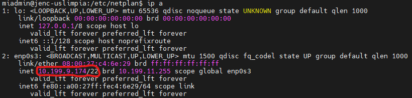
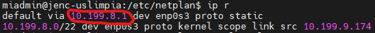
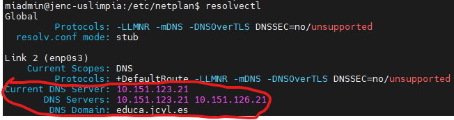
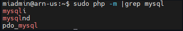
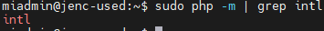

# CFGS Desarrollo de Aplicaciones Web

# Entorno de Desarrollo

- [CFGS Desarrollo de Aplicaciones Web](#cfgs-desarrollo-de-aplicaciones-web)
- [Entorno de Desarrollo](#entorno-de-desarrollo)
- [Ubuntu Server 24.04.3 LTS](#ubuntu-server-24043-lts)
  - [1- **Configuración inicial**](#1--configuración-inicial)
    - [Nombre y configuraicón de red](#nombre-y-configuraicón-de-red)
    - [**Actualizar el sistema**](#actualizar-el-sistema)
    - [**Configuración fecha y hora**](#configuración-fecha-y-hora)
    - [**Configuración regional**](#configuración-regional)
    - [**Cuentas administradoras**](#cuentas-administradoras)
    - [**Memoria y almacenamiento**](#memoria-y-almacenamiento)
    - [**Habilitar cortafuegos**](#habilitar-cortafuegos)
    - [**Instalar antivirus**](#instalar-antivirus)
  - [2- Instalación del servidor web](#2--instalación-del-servidor-web)
  - [3- PHP FPM](#3--php-fpm)
    - [Instalar php](#instalar-php)
  - [4- MariaDb](#4--mariadb)
    - [Instalación](#instalación)
    - [**------ Modulos php ------**](#-------modulos-php-------)
      - [**a) php8.3-mysql**](#a-php83-mysql)
      - [**b) php8.3-intl**](#b-php83-intl)
  - [5- XDebug](#5--xdebug)
  - [6- DNS](#6--dns)
  - [7- SFTP](#7--sftp)
  - [8- Apache Tomcat](#8--apache-tomcat)
  - [9- LDAP](#9--ldap)


|                           DAW/DWES Tema2                            |
| :-----------------------------------------------------------------: |
|                                      |
| INSTALACIÓN, CONFIGURACIÓN Y DOCUMENTACIÓN DE ENTORNO DE DESARROLLO |

# Ubuntu Server 24.04.3 LTS

Este documento es una guía detallada del proceso de instalación y configuración de un servidor de aplicaciones en Ubuntu Server utilizando Apache, con soporte PHP y MySQL

## 1- **Configuración inicial**

### Nombre y configuraicón de red

> **Nombre de la máquina**: jenc-used\
> **Memoria RAM**: 2G\
> **Particiones**: 150G(/) y resto (/var)\
> **Configuración de red interface**: xxxx \
> **Dirección IP** :10.199.9.174/22\
> **GW**: 10.199.8.1/22\
> **DNS**: 10.151.123.21 y 10.151.126.21

Para cambiar el nombre de la maquina iremos al fichero **/etc/hostname** y aqui cambiaremos su contenido por el nombre de usuario deseado, despues iremos al fichero **/etc/hosts** y cambiaremos el nombre que pone en la segunda linea por el mismo que pusimos en el anterior fichero.

```bash
127.0.0.1 localhost
127.0.1.1 jenc-used2

# The following lines are desirable for IPv6 capable hosts
::1     ip6-localhost ip6-loopback
fe00::0 ip6-localnet
ff00::0 ip6-mcastprefix
ff02::1 ip6-allnodes
ff02::2 ip6-allrouters
```

Despues usamos **hostnamectl set-hostname nombre** y ya estaría cambiado el nombre de la maquina.

Para ver el nombre de la maquina usaremos **hostname** o **hostnamectl** que contiene mas información.

Para configurar la red, primero copiaremos el archivo de red **/etc/netplan/50-cloud-init.yaml** y lo llamaremos **enp0s3.yaml** en la misma carpeta.

```bash
cd ../../etc/netplan
cp 50-cloud-init.yaml enp0s3.yaml
```

Despues editaremos el fichero de configuración del interface de red  **/etc/netplan/enp0s3.yaml** de la siguiente manera,

```bash
sudo nano enp0s3.yaml
```

```bash

# This is the network config written by 'subiquity'
network:
  version: 2
  ethernets:
    enp0s3:
      dhcp4: false
      dhcp6: false
      addresses: [10.199.9.174/22]
      nameservers:
        addresses: [10.151.123.21,10.151.126.21]
        search: [educa.jcyl.es]
      routes:
        - to : default
          via: 10.199.8.1
```

Despues de haber aplicado esta configuración haremos una copia de seguridad.

```bash
sudo cp enp0s3.yaml enp0s3.yaml.bk.fecha
```

Despues usaremos el comando **sudo netplan apply** para aplicar la configuración.

Probaremos si funciona haciendo ping a la gateway, al dns, a una pagina web y a otra maquina en la misma red.

```bash
ping 10.199.11.84
ping 10.199.8.1
ping 10.151.123.21
ping www.google.com
```

Si obtenemos respuesta de todas correctamente, tendremos la configuración de red finalizada.

Podria ser que este desactivado en la red el protocolo para hacer ping fuera de esta y por esto no deje hacer ping al dns o a internet.

Para comprobar la ip usaremos **ip a** 



Para comprobar la gateway usaremos **ip r** 



Para comprobar los dns y el dominio usaremos **resolvectl** 



### **Actualizar el sistema**

```bash
sudo apt update
sudo apt upgrade
```

### **Configuración fecha y hora**

Para ver la informacion de la zona horaria, fecha y hora usaremos **timedatectl**, si no es correcto usaremos **timedatectl set-timezone Europe/Madrid** para establecer la zona horaria en madrid, para ver otras zonas horarias usaremos **timedatectl list-timezones** y sustituiremos Europe/Madrid por la zona horaria deseada.

[Información mas detallada](https://somebooks.es/establecer-la-fecha-hora-y-zona-horaria-en-la-terminal-de-ubuntu-20-04-lts/ "Cambiar fecha y hora")

### **Configuración regional**

Con **locale** podremos ver la información de idioma y región aplicados, con **locale -a** podremos ver la lista de locales instalados, para instalar uno nuevo **sudo locale-gen es_ES.UTF-8**, los locales se contienen por defecto en **/etc/default/locale**

```bash
sudo locale-gen en_GB.UTF-8
sudo locale-gen pt_PT.UTF-8
sudo update-locale
locale -a
locale
```

### **Cuentas administradoras**

De base el sistema tiene la cuenta **root**, y la cuenta ***miadmin*** la habremos configurado en la instalación del sistema, esta ya sería administrador.

Tendremos que crear otra cuenta y hacerla administrador, esta se llamara **miadmin2**.

Primero comprobaremos los grupos del usuario **miadmin**

```bash
groups miadmin
```

Despues crearemos el usuario **miadmin2** y le asignaremos todos los grupos de miadmin menos el grupo personal (El que tiene su nombre)

```bash
sudo useradd -m -G  sudo,adm,cdrom,dip,plugdev miadmin2
```

Despues le pondremos contraseña.

```bash
sudo passwd miadmin2
```

> - [X] root(inicio)
> - [X] miadmin/paso
> - [X] miadmin2/paso

 ### **Memoria y almacenamiento**

Para ver la memoria del sistema usaremos **free -h**.

Para ver el almacenamiento del sistema usaremos **df -h**.

### **Habilitar cortafuegos**

Primero usaremos el comando **sudo ufw enable** para habilitar el cortafuegos.


Despues usaremos el comando **sudo ufw allow 22** para permitir el acceso al puerto 22, el cual es el puerto de SSH, a partir de este momento la maquina podra ser operada en remoto desde la red.

Luego usaremos **sudo ufw status numbered** para comprobar el estado del cortafuegos y ver los puertos abiertos, usaremos **sudo ufw delete 2 (O el numero de regla que sea)** para cerrar el puerto 22 en ipV6, ya que representa una vulnerabilidad.

Por ultimo usaremos **ufw status** para ver el estado del cortafuegos y los puertos abiertos de este.

```bash
sudo ufw enable
sudo ufw allow 22
sudo ufw status numbered
sudo ufw delete 2
sudo ufw status
```

### **Instalar antivirus**

Instalaremos el antivirus clamav, despues pararemos el servicio y actualizaremos la base de datos de virus, depues volveremos a iniciarlo y ya estaria instalado y funcional. Importante no instalar el clamav daemon, consume muchisimos recursos del sistema.

```bash
sudo apt install clamav
sudo systemctl stop clamav-freshclam
sudo freshclam
sudo systemctl start clamav-freshclam
```

Para ver la version instalada **clamscan -V**

## 2- Instalación del servidor web

Primero tendremos que actualizar el sistema, despues instalaremos apache2, luego comprobaremos que apache2 esta activo, si este esta activo tendremos que abrir el puerto 80 en el cortafuegos, luego quitaremos la regla de v6 ya que representa una vulnerabilidad, despues usaremos **ufw status** para ver que el puerto 80 esta abierto en este.

Si al entrar desde otro equipo a la ip del servidor sale apache works, el servidor funciona correctamente.

```bash
sudo apt update
sudo apt upgrade
sudo apt install apache2
sudo systemctl status apache2
sudo ufw allow 80
sudo ufw delete 3 (o el numero de regla que sea)
sudo ufw status
```

Lo siguiente es crear las cuentas de los usuarios web, se pueden crar de 2 formas, con **addduser** puedes ponerle la contraseña en la creación de la cuenta y con **useradd** tienes que usar **passwd** para ponerle la contraseña.

```bash
sudo adduser --home /var/www/html --shell /bin/bash --ingroup  www-data operadorweb

sudo useradd -d /var/www/html -s /bin/bash -G www-data operadorweb
sudo passwd operadorweb
```

Importante no olvidar cambiar el dueño de la carpeta **/var/www/html** al grupo www-data.

```bash
sudo chown -R www-data:www-data /var/www/html
```

Despues iremos al directorio **/etc/apache2/sites-enabled** y aqui cambiaremos el deirectorio de errores al deseado.

Recordar que primero el directorio debe existir, si no existe crearlo con **mkdir**.

```bash
sudo mkdir /var/www/html/error
sudo nano /etc/apache2/sites-enabled/000-default.conf

        ErrorLog /var/www/html/error/error.log
```

Despues iremos al directorio **/etc/apache2/apache2.conf** y aqui cambiaremos el allow override del directorio **/var/www/** de none a All.

```bash
sudo nano /etc/apache2/apache2.conf

<Directory /var/www/>
        Options Indexes FollowSymLinks
        AllowOverride All
        Require all granted
</Directory>
```

Finalmente reiniciaremos el servicio apache2 y comprobaremos que funciona, si el servicio de apache2 funciona ya estara configurado.

```bash
sudo systemctl restart apache2
sudo systemctl status apache2
```

## 3- PHP FPM

### Instalar php

Primero Instalaremos php8.3-fpm y php8.3, despues tendremos que abilitar unas librerias que necista php para poder conectarse con apache, luego tendremos que ir al directorio de los ficheros de configuracion de php y hacer una copia de seugridad del fichero de configuración, luego abrimos el fichero de configuración y cambiamos las opciones a nuestras necesidades.

```bash
suddo apt update
sudo apt install php8.3-fpm php8.3

sudo a2enmod proxy_fcgi setenvif
sudo a2enconf php8.3-fpm

cd /etc/php/8.3/fpm
sudo cp php.ini php.ini.bk
sudo nano php.ini
```
| General | Desarrollo | Producción |
| ---- | :----- | :---- |
| común | file-uploads = On <br> allow-url_fopen = On <br>memory_limit =  256M <br>upload_max_filesize = 100M <br>max_execution_time = 360 <br> date.timezone = Europe/Madrid  | file-uploads = On <br> allow-url_fopen = On <br>memory_limit =  256M <br>upload_max_filesize = 100M <br>max_execution_time = 360 <br> date.timezone = Europe/Madrid|
|Errores | display_errors  = On <br> error_reporting = E_ALL<br> display_startup_errors = On <br>|   display_errors  = Off <br>error_reporting = E_ALL & ~E_NOTICE <br>display_startup_errors = Off <br>log_errors = On

Por ultimo reiniciaremos apache y php y comprobaremos que funciona

```bash
sudo systemctl restart apache2
sudo systemctl restart php8.3-fpm
sudo systemctl status php8.3-fpm
sudo systemctl status apache2
```

Si en algun momento se quiere modificar la version que php usa se podra cambiar con este comando, esto es especialmente util si se nota que php no esta funcionando como unos espera.

```bash
sudo update-alternatives --config php
```

## 4- MariaDb

### Instalación

Primero instalaremos el servicio mariadb, después tendremos que cambiar en el fichero de configuración el puerto y las direcciones desde las que se puede accder al servicio de local a todas, finalmente tendremos que reiniciar el servicio de mariadb y comprobar que esta funcionando en 0.0.0.0 y el puerto 3306.

```bash
sudo apt udpate
sudo apt install mariadb-server -y

sudo nano /etc/mysql/mariadb.conf.d/50-server.cnf
      port=3306 (Esto por ahora no ha echo falta)
      bind-address = 0.0.0.0

sudo systemctl restart mariadb
sudo ss -punta |grep mariadb
```

Lo siguiente tendremos que abrir el puerto 3306 en el firewall y deshabilitar la regla v6.

```bash
sudo ufw allow 3306
sudo ufw status numbered
sudo ufw delete 5 (Nºde la regla v6 del puerto)
sudo ufw status
```

Ahora entraremos a la consola de mariadb y tendremos que crear un usuario administrador, luego comprobaremos que existe y tiene accesoa a todo.

```bash
sudo mariadb
GRANT ALL ON *.* TO 'adminsql'@'%' IDENTIFIED BY 'password' WITH GRANT OPTION;
SELECT User, Host FROM mysql.user;
exit
```

Despues tendremos que ejecutar el script de seguridad de sql para aseguraranos de que esta seguro.

```bash
sudo mysql_secure_installation
```

-En el primer paso preguntará por la contraseña de root para MariaDB, pulsa la tecla Enter ya que no hay contraseña definida.

-en la siguiente pregunta nos preguntara si queremos cambiar al socket unix, le diremos que si.

-La siguiente, preguntará si quieres asignar una contraseña para el usuario “root", indicar que si y poner paso de contraseña.

-En el cuarta paso preguntará si quieres eliminar usuario anónimo, aquí indica que Sí quieres borrar los datos.

-Después preguntará si quieres desactivar el acceso remoto del usuario “root”, aquí indica que Sí quieres desactivar acceso remoto para usuario por seguridad.

-De nuevo preguntará si quieres eliminar la base de datos test, aquí indica de nuevo que Sí quieres borrar las base de datos de prueba.

-Por último, preguntará si quieres recargar privilegios, aquí indica que Sí.

### **------ Modulos php ------**

#### **a) php8.3-mysql**

Instalaremos la extensión que permite a PHP conectarse y comunicarse con servidores de bases de datos MySQL o MariaDB. Sin este módulo, PHP no puede ejecutar consultas SQL, ni leer, ni escribir datos en su base de datos. Instalación del módulo php8.3-mysql y reiniciar el servicio php8.3-fpm

```bash
sudo apt install php8.3-mysql
sudo systemctl restart php8.3-fpm
sudo php -m | grep mysql
```



#### **b) php8.3-intl**

Instalaremos una extensión de internacionalización básica en la biblioteca ICU(International Components for Unicode). Permite que PHP muestre información adaptada a la región e idioma, sin que tengas que hacerlo manualmente.

```bash
sudo apt install php8.3-intl
sudo systemctl restart php8.3-fpm
sudo php -m | grep intl
```



## 5- XDebug

Primero comprobaremos si tenemos instalada la extensión xdebug, si no la instalaremos

```bash
sudo php -v | grep xdebug
sudo apt install php8.3-xdebug
```

Despues entraremos en el fichero de configuracion de xdebug y pergaremos las siguientes lineas en el.

```bash
sudo nano /etc/php/8.3/fpm/conf.d/20-xdebug.ini

xdebug.mode=develop,debug
xdebug.start_with_request=yes
xdebug.client_host=127.0.0.1
xdebug.client_port=9003
xdebug.log=/tmp/xdebug.log
xdebug.log_level=7
xdebug.idekey="netbeans-xdebug"
xdebug.discover_client_host=1
```

Luego tendremos que cambiar los permisos del fichero de los logs

```bash
sudo touch /tmp/xdebug.log
sudo chmod 666 /tmp/xdebug.log
sudo chown root:root /tmp/xdebug.log
```

Por ultimo reiniciaremos los servicios de php y apache, si xdebug se ha instalado correctamente esto se vera reflejado en el phpinfo().

```bash
sudo systemctl restart apache2
sudo systemctl restart php8.3-fpm
```

## 6- DNS
## 7- SFTP
## 8- Apache Tomcat
## 9- LDAP

---

> **James Edward Nuñez Cuzcano**  
> Curso: 2025/2026  
> 2º Curso CFGS Desarrollo de Aplicaciones Web  
> Despliegue de aplicaciones web
