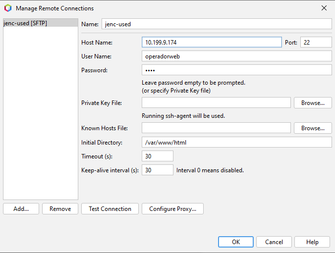

# CFGS Desarrollo de Aplicaciones Web

# Windows 11

- [CFGS Desarrollo de Aplicaciones Web](#cfgs-desarrollo-de-aplicaciones-web)
- [Windows 11](#windows-11)
  - [1- **Configuración inicial**](#1--configuración-inicial)
    - [**Nombre y configuración de red**](#nombre-y-configuración-de-red)
    - [**Cuentas administradoras**](#cuentas-administradoras)
  - [2- **Navegadores**](#2--navegadores)
  - [3- **MobaXterm**](#3--mobaxterm)
  - [4- **Netbeans**](#4--netbeans)
    - [**Creación de proyectos**](#creación-de-proyectos)
  - [5 **Visual Studio Code**](#5-visual-studio-code)

## 1- **Configuración inicial**
### **Nombre y configuración de red**
### **Cuentas administradoras**
## 2- **Navegadores**
## 3- **MobaXterm**
## 4- **Netbeans**

### **Creación de proyectos**

Al crear un proyecto seleccionar **PHP -> PHP Application**

Los proyectos han de estar localizados en la carpeta de proyectos, todos al nivel base, el proyecto y la carpeta han de ser iguales.

Hay que seleccionar **Run as: Remote Web Site**, lo siguiente hay que crear una conexion con el servidor web.

En la pantalla de creación de conexión hay que ponerle un nombre significativo a la coenxión, como el nombre de la maquina a la que se conecta, hay que poner la ip de la maquina y el puerto usado en sftp(22), el usuario web que se vaya a usar para subir los archivos y su contraseña, el resto se deja por defecto.

Despues hay que probar la conexión para ver que funciona bien. (Si dice que la autenticidad no se puede comprobar no importa).

El directorio de subida tambien se tiene que llamar igual que el proyecto.

El metodo de subida puede ser al guardar o al lanzar el proyecto, a preferencia del usuario.

Para borrar un proyecto solamente hay que hacer click derecho en el proyecto y darle a **borrar** 

## 5 **Visual Studio Code**

---
> **James Edward Nuñez Cuzcano**  
> Curso: 2025/2026  
> 2º Curso CFGS Desarrollo de Aplicaciones Web  
> Despliegue de aplicaciones web
