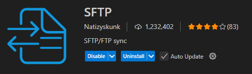
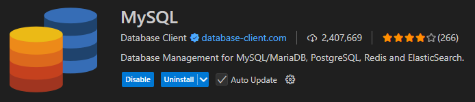
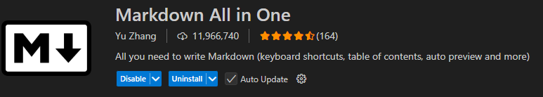
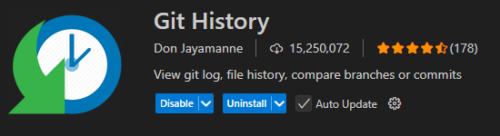
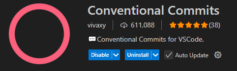
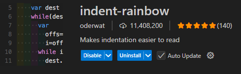
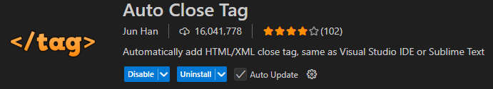
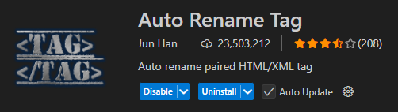
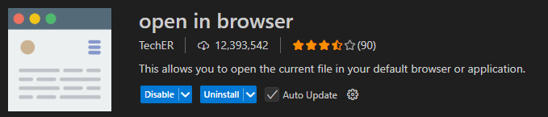
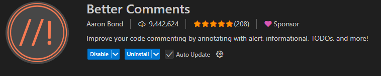

# CFGS Desarrollo de Aplicaciones Web

# Windows 11


- [CFGS Desarrollo de Aplicaciones Web](#cfgs-desarrollo-de-aplicaciones-web)
- [Windows 11](#windows-11)
  - [1- **Configuración inicial**](#1--configuración-inicial)
    - [**Nombre y configuración de red**](#nombre-y-configuración-de-red)
    - [**Cuentas administradoras**](#cuentas-administradoras)
  - [2- **Navegadores**](#2--navegadores)
  - [3- **MobaXterm**](#3--mobaxterm)
  - [4- **Netbeans**](#4--netbeans)
    - [**Creación y borrado de proyectos**](#creación-y-borrado-de-proyectos)
  - [5 **Visual Studio Code**](#5-visual-studio-code)
    - [Extensiones importantes](#extensiones-importantes)
      - [**SFTP**](#sftp)
      - [**MySQL**](#mysql)
      - [**Markdown All in One**](#markdown-all-in-one)
      - [**Git history**](#git-history)
      - [**Conventional Commits**](#conventional-commits)
    - [Otras extensiones utiles](#otras-extensiones-utiles)
      - [**Indent rainbow**](#indent-rainbow)
      - [**Auto close tag**](#auto-close-tag)
      - [**Auto rename tag**](#auto-rename-tag)
      - [**Open in browser**](#open-in-browser)
      - [**Better comments**](#better-comments)

## 1- **Configuración inicial**
### **Nombre y configuración de red**
### **Cuentas administradoras**
## 2- **Navegadores**
## 3- **MobaXterm**

MobaXterm es una herramienta muy versatil que permite hacer conexiones de ssh, sftp, abir consolas de cmd, wsl, navegador y muchas mas, y permite almacenarlas con sus contraseñas.

Entre sus muchos servicios tambien permite ejecutar servidores de forma local.

MobaXterm se puede descargar desde [aqui](https://mobaxterm.mobatek.net), este programa se puede descargar de forma portable o instalada.

## 4- **Netbeans**

### **Creación y borrado de proyectos**

Al crear un proyecto seleccionar **PHP -> PHP Application**

Los proyectos han de estar localizados en la carpeta de proyectos, todos al nivel base, el proyecto y la carpeta han de ser iguales.

Hay que seleccionar **Run as: Remote Web Site**, lo siguiente hay que crear una conexion con el servidor web.

En la pantalla de creación de conexión hay que ponerle un nombre significativo a la coenxión, como el nombre de la maquina a la que se conecta, hay que poner la ip de la maquina y el puerto usado en sftp(22), el usuario web que se vaya a usar para subir los archivos y su contraseña, el resto se deja por defecto.

Despues hay que probar la conexión para ver que funciona bien. (Si dice que la autenticidad no se puede comprobar no importa).


El directorio de subida tambien se tiene que llamar igual que el proyecto.

El metodo de subida puede ser al guardar o al lanzar el proyecto, a preferencia del usuario.

Para borrar un proyecto solamente hay que hacer click derecho en el proyecto y darle a **borrar** 

## 5 **Visual Studio Code**

### Extensiones importantes

#### **SFTP**

SFTP es una extensón que te permite conectar tu proyecto a un servidor y sincronizar archivos

[](https://marketplace.visualstudio.com/items?itemName=Natizyskunk.sftp)

Pulsando F1 y seleccionando SFTP:Config te crea una carpeta llamada .vscode en el proyecto, que tiene dentro un archivo llamado sftp.json en el que podras configurar la conexion e incluso configurar que no se sube al servidor, el archivo se deveria de ver asi:

```json
{
    "name": "jenc-used",
    "host": "10.199.9.174",
    "protocol": "sftp",
    "port": 22,
    "username": "operadorweb",
    "remotePath": "JENCDWAWProyectoDAW",
    "uploadOnSave": true,
    "useTempFile": false,
    "openSsh": false,
    "ignore": [
        ".vscode",
        "nbproject",
        ".git",
        ".gitignore",
        "LICENSE",
        ".DS_Store",
        "doc/Comandos.docx",
        "doc/Ejercicios tema 1.docx"
    ]
}
```

Haciendo clic derecho en cualquier parte del explorador de archivos te da la opcion de subir el proyecto al servidor, bajar el proyecto de este o sincronizarlos.

Tambien incluye en la barra lateral un explorador de archivos sftp del servidor.

#### **MySQL**

MySQL es una extension que te permite conectarte a un host y gestionar sus bases de datos de forma remota y guardar la conexion, soporta muchos tipos de bases de datos, es facil de configurar y tiene un historial de querys ejecutadas recientemente en cada base de datos, todo esto desde su menu de la barra lateral.

[](https://marketplace.visualstudio.com/items?itemName=cweijan.vscode-mysql-client2)

#### **Markdown All in One**

Esta extension sirve para poder trabajar facilmente con markdown y poder imprimirlo a html

[](https://marketplace.visualstudio.com/items?itemName=yzhang.markdown-all-in-one)

#### **Git history**

Git History es una extension que te permite ver de forma visual los commits y ramas del proyecto.

[](https://marketplace.visualstudio.com/items?itemName=donjayamanne.githistory)

#### **Conventional Commits**

Esta extension sirve de ayuda a la hora de hacer commits con git, esta ayuda a crear commits con estructura estandarizada de manera simple y rapida

[](https://marketplace.visualstudio.com/items?itemName=vivaxy.vscode-conventional-commits)

### Otras extensiones utiles

#### **Indent rainbow**

Esta extension cambia el color del indent de los elementos anidados para mayor claridad visual

[](https://marketplace.visualstudio.com/items?itemName=oderwat.indent-rainbow)

#### **Auto close tag**

Esta extension pone automaticamente las etiquetas de cerrado en html y xml

[](https://marketplace.visualstudio.com/items?itemName=formulahendry.auto-close-tag)

#### **Auto rename tag**

Esta extension cambia automaticamente la etiqueta pareja de la que se edite en html y xml

[](https://marketplace.visualstudio.com/items?itemName=formulahendry.auto-rename-tag)

#### **Open in browser**

Esta extension da la opcion al hacer click derecho en un html abrirlo directamente en el navegador predeterminado o el que elijamos

[](https://marketplace.visualstudio.com/items?itemName=techer.open-in-browser)

#### **Better comments**

Esta extension cambia el color de los comentarios segun lo que pongas al principio del comentario, como TODO, !, ?, etc para mayor claridad visual del codigo

[](https://marketplace.visualstudio.com/items?itemName=aaron-bond.better-comments)

---
> **James Edward Nuñez Cuzcano**  
> Curso: 2025/2026  
> 2º Curso CFGS Desarrollo de Aplicaciones Web  
> Despliegue de aplicaciones web
